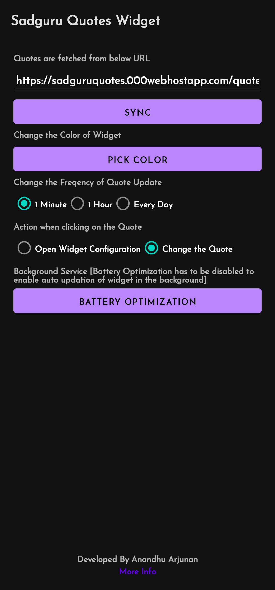

# Sadguru Quotes Widget - Android 
## A simple quotes widget Application

Please Note : It is just a study project to improve my knowlegde in Android Framework.There are many problems,bugs ,design issues with Application.

It is an Android Widget app that displays famous quotes by Sadguru [Indian Mystic]
.Sadhguru is famous worldwide for its Isha-foundation. He spread knowledge on yoga and well-being of folks. The Isha Foundation is the major establishment, through which he executes all his yoga programs, various social and community development activities.

## Screenshots

  
   
  
        
  

## Planned Features

- Multiple Widget Handling

## Problems Facing

- Multiple Widget Handling

## Tech

App uses some libraries and Frameworks, it is nothing without them.

-[Color Picker By Dhaval] - https://github.com/Dhaval2404/ColorPicker

      

## Installation

It requires Java 11.

## Development

Want to contribute? Great! Thank you for showing interest in this Project.

## License

Apache 2.0

**Free Software, Hell Yeah!**
